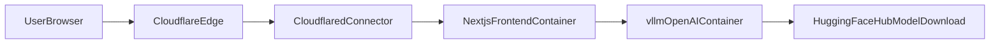

# V2 System Architecture & Deployment Plan

## Objective

Migrate the existing Next.js app from Vercel + Gemini to a **single-node, production-style prototype** on Ubuntu using local vLLM (`nvidia/Nemotron-3-Super-120B-A12B-FP8`), Docker Compose, and Cloudflare Tunnel as the only external ingress.

This V2 explicitly prioritizes:

- Stronger network isolation
- Reproducible model serving
- Startup/readiness reliability
- Enterprise-aligned security posture (without claiming true multi-node HA)

## Scope and Positioning

- **Deployment class:** single-node resilient prototype (not true HA)
- **Compute:** Ubuntu host, 2x RTX 6000 Ada, high-CPU/high-RAM
- **Ingress:** Cloudflare Tunnel only
- **Default port publishing:** Next.js and (optionally) vLLM smoke-test ports bound to **loopback only** on the host (`127.0.0.1:3000`, `127.0.0.1:8000`) so nothing on the LAN/WAN hits those ports by default; `cloudflared` on the same host uses `http://localhost:3000` (or `127.0.0.1:3000`) as origin. **IT:** typically **no inbound firewall rule** for port 3000; confirm **outbound HTTPS** to Cloudflare is allowed for the tunnel.
- **Operator commands:** committed runbook at `[docs/deploy-runbook.md](../../project/onco-query-assistant/docs/deploy-runbook.md)` in this workspace (path from repo root: `docs/deploy-runbook.md`).

## Target Architecture

## Phase 1: App Refactor (Gemini -> Local OpenAI-Compatible Provider)

### Tasks

- Replace Gemini provider usage in API route(s) with `@ai-sdk/openai` provider instance targeting internal vLLM URL.
- Keep model id configurable via env var (`LOCAL_LLM_MODEL`) instead of hardcoding.
- Add request timeout + retry/backoff behavior for model warm-up periods.
- Ensure `next.config.js` uses `output: 'standalone'`.

### Files to update

- [package.json](package.json)
- `.env.example` (or project env template; create if missing)
- [src/app/api/chat/route.ts](src/app/api/chat/route.ts) and other routes under `src/app/api/` that call Gemini ([src/lib/gemini/report-generator.ts](src/lib/gemini/report-generator.ts))
- [next.config.js](next.config.js) — add `output: 'standalone'`

### Required env vars

- `LOCAL_LLM_URL=http://vllm-backend:8000/v1`
- `LOCAL_LLM_MODEL=nvidia/Nemotron-3-Super-120B-A12B-FP8`
- `LOCAL_LLM_API_KEY=local-no-key-required` (placeholder for SDK compatibility)

## Phase 2: Containerization and Runtime Hardening

### Dockerfile (Next.js)

- Use multi-stage build with standalone output.
- Use non-root runtime user.
- Set `NODE_ENV=production` and disable telemetry.

### Compose design (V2)

- Add three services:
  - `vllm-backend`
  - `nextjs-frontend`
  - `cloudflared`
- Use one private bridge network for east-west traffic.
- **Recommended default:** publish Next.js as `**127.0.0.1:3000:3000`** (host loopback only). Cloudflare Tunnel on the same host forwards to `**http://localhost:3000\*\`. This pairs cleanly with tunnel docs that use host networking for `cloudflared`while keeping the app off`0.0.0.0`.
- **Alternative:** no `ports:` on Next.js; run `cloudflared` on the same Compose network with origin `**http://nextjs-frontend:3000` (service DNS name). Same security idea: no public host port.
- Publish vLLM on loopback for operator smoke tests from SSH: `**127.0.0.1:8000:8000`**. App still calls `**http://vllm-backend:8000/v1\*\` on the internal network.
- Do **not** use bare `3000:3000` / `8000:8000` on untrusted networks unless you intend LAN-wide direct access and have firewall rules.

### Reliability controls

- Pin vLLM image tag (no `latest`).
- Add healthchecks:
  - vLLM health endpoint check
  - Next.js HTTP health check route (`/api/health` or similar)
- Gate startup with service health dependency where supported.
- Configure restart policy: `unless-stopped`.

### GPU and model settings

- Reserve 2 GPUs and set tensor parallelism to 2.
- Set conservative defaults for memory and context length, then tune under load.
- Mount Hugging Face cache for faster restarts.

## Phase 3: Secrets and Compliance Controls

### Secret handling

- Move `HF_TOKEN` out of shell history practices.
- Use one approved mechanism:
  - `.env` file with strict permissions, or
  - Docker secrets, or
  - external secret manager.

### Data/privacy statement

- Document that traffic is tunneled via Cloudflare infrastructure.
- Update language from “strict data privacy” to “private-origin exposure with Cloudflare-mediated ingress,” unless legal/compliance signs off.

## Phase 4: Deployment Runbook (Ubuntu)

Shell-level steps, `curl` checks, and IT/network notes are in **[docs/deploy-runbook.md](docs/deploy-runbook.md)** in the repository.

### Preflight

- Install NVIDIA drivers + container toolkit.
- Verify GPU visibility in Docker runtime.
- Verify disk space for model weights and cache.

### Deploy

- Build and start stack with Compose.
- Confirm healthchecks green.
- Validate local functional path (see runbook):
  - vLLM `/v1/models` and a minimal `/v1/chat/completions`
  - Next.js `GET /` (and `/api/health` once added)
  - `POST /api/chat` with a minimal body matching [src/app/api/chat/route.ts](src/app/api/chat/route.ts)
  - Optional: `docker compose exec` fetch from Next.js container to `http://vllm-backend:8000/v1/models`

### Tunnel

- Create tunnel in Cloudflare Zero Trust.
- Route public hostname to `**http://localhost:3000` when using loopback publish + tunnel on host (or to `http://nextjs-frontend:3000` if tunnel is on the Compose network without host publish).
- Validate external HTTPS reachability; confirm no unintended exposure of `:3000` on `0.0.0.0`.

## Phase 5: Verification and Acceptance Criteria

### Functional checks

- Chat completion/stream works end-to-end.
- Model id and base URL read from env vars.

### Security checks

- No direct public port exposure for app/API (except intentional localhost binds).
- Secrets are not committed to git.

### Operational checks

- Cold start documented (time to ready after restart).
- Restart behavior validated for both app and model services.
- Basic logs/metrics capture path documented.

## Deliverables

- Hardened app provider refactor to local vLLM
- Production-style Dockerfile for Next.js standalone
- V2 `docker-compose.yml` including healthchecks and tunnel service
- Updated env template and operator runbook notes
- Acceptance checklist for demo readiness

## Out of Scope (for this V2)

- True multi-node HA/failover across multiple servers
- Kubernetes orchestration
- Multi-region ingress

## Risk Register

- **Model/runtime compatibility risk:** mitigated by pinned vLLM image and tested config matrix.
- **Long model load times:** mitigated by readiness probes and retry strategy.
- **Tunnel dependency risk:** mitigated by explicit compliance note and fallback local access path.
